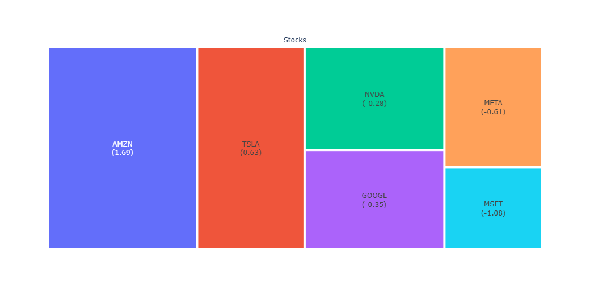
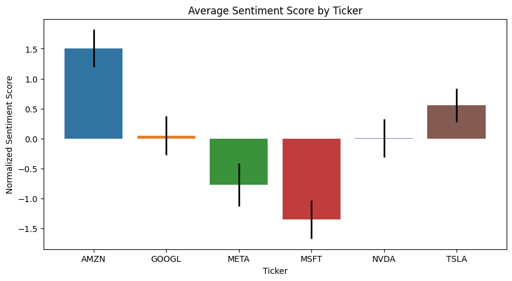
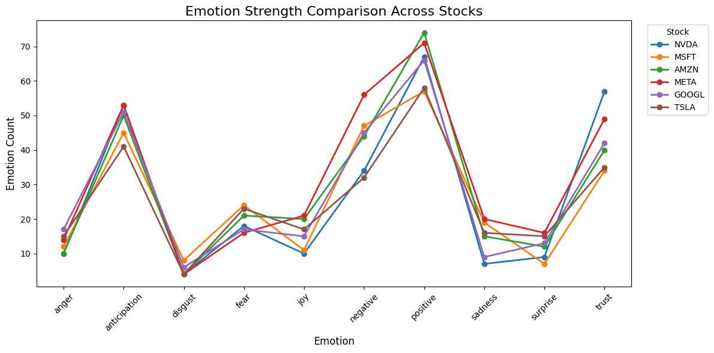
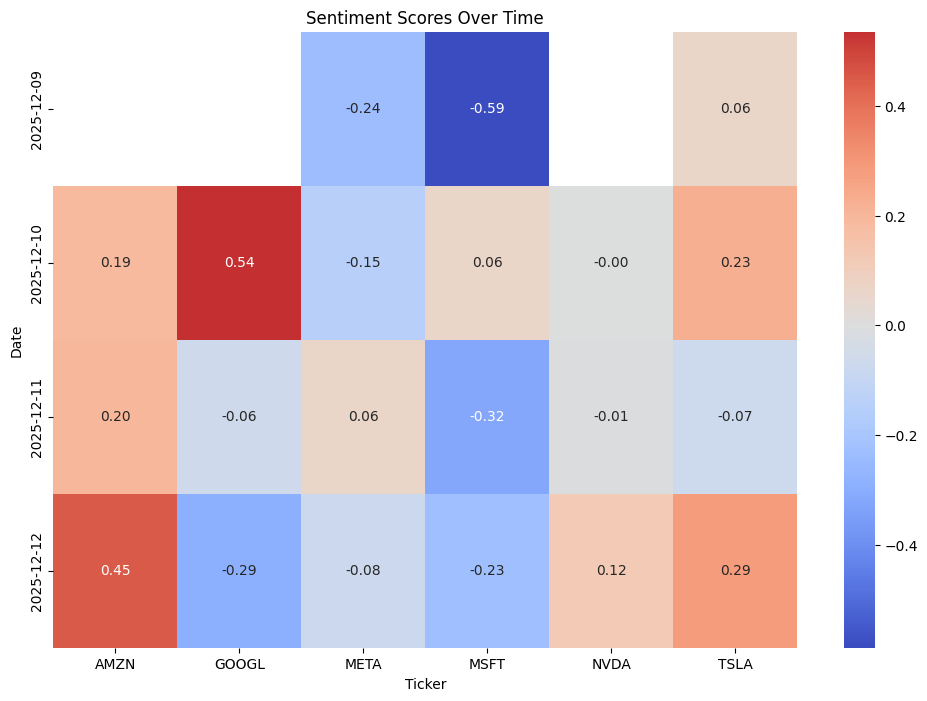
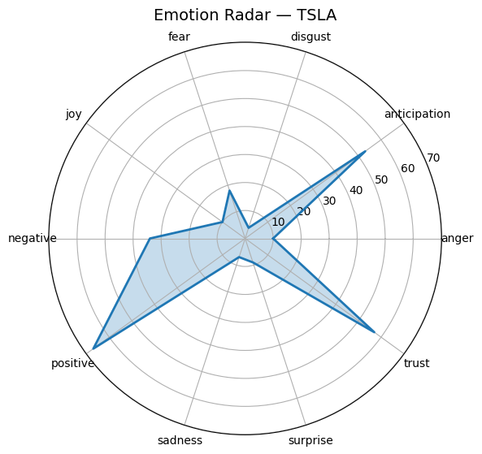
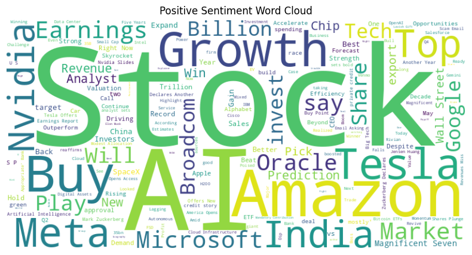
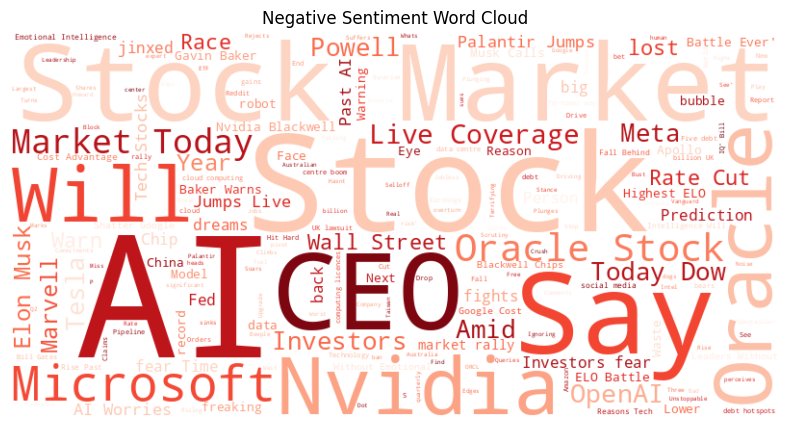
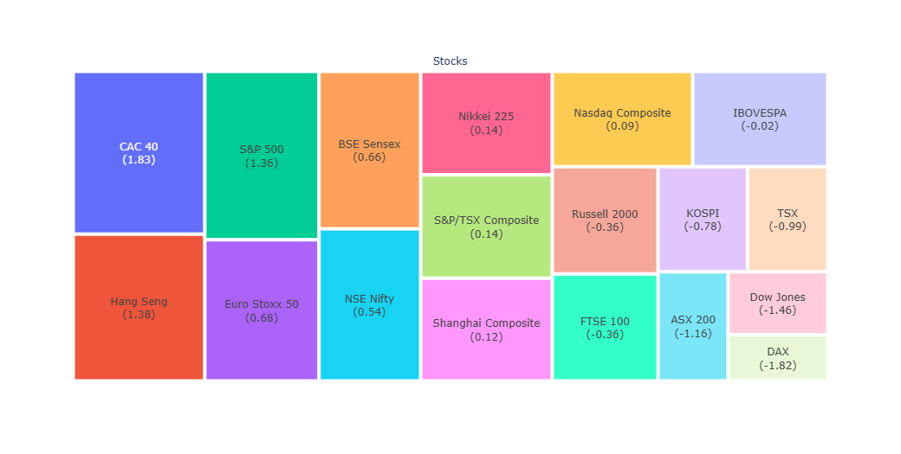

# 📰 Stock News Sentiment Analysis

## 📌 Overview

This project performs sentiment analysis on financial news headlines for major tech stocks.  
News is scraped from **FinViz**, parsed using **BeautifulSoup**, processed with **Pandas**, analyzed using **NLTK VADER**, and visualized using **Matplotlib**.

The project was developed on **Kaggle Notebook**.

---

## 🛠️ Technologies Used

- **Python 3**
- **Pandas**
- **NumPy**
- **BeautifulSoup (bs4)**
- **urllib.request**
- **NLTK VADER Sentiment Analyzer**
- **NRC Emotion Lexicon**
- **Matplotlib**
- **Plotly Express**
- **FinViz.com (News Source)**

---

## ✨ Features

### 🔍 Web Scraping
- Fetches live financial news headlines from FinViz.
- Uses custom `user-agent` to avoid access restrictions.

### 📰 Headline Extraction
- Parses each row of the news table for:
  - Ticker
  - Date
  - Time
  - News Headline

### 😊 Sentiment Analysis
- Computes **VADER compound sentiment score** for each headline.
- Classifies headlines into positive, negative, or neutral sentiment.

### 📊 Visualization
- Groups sentiment by ticker and date.
- Plots bar charts comparing company sentiment trends.

---

## 🏗️ How I Built It

### 1️⃣ Fetching and Parsing Data  
I created FinViz URLs for each ticker and fetched the HTML using `urllib.request` with a custom user-agent.  
Then, using **BeautifulSoup**, I located the `news-table` containing all news rows.

### 2️⃣ Cleaning and Structuring Data  
For each news row, I extracted:
- Headline text  
- Date and time  
- Corresponding ticker  

All entries were stored in a **Pandas DataFrame**.

### 3️⃣ Sentiment scoring
Using VADER's polarity_scores(), I computed the compound score for each headline and appended it to the DataFrame.

### 4️⃣ Visualization
To analyze trends, I grouped sentiment by ticker and date and plotted the results using Matplotlib.

### 5️⃣ Key Visualizations 📊 (Important Graphs)

These graphs provide the core analytical insights of the Stock News Sentiment Project.
- Normalized Sentiment Bar Chart – Shows each stock’s average sentiment score normalized using Z-score, with error bars reflecting sentiment volatility.
- Sentiment Heatmap Over Time – Displays how sentiment changes day-by-day for each stock, helping identify trends, spikes, and market reactions.
- Treemap of Stock Sentiment Strength – A size-based map where larger blocks represent stronger sentiment magnitude (positive or negative), providing a fast visual ranking of which stocks dominate sentiment.
  
These three graphs form the primary backbone of sentiment understanding: overall sentiment → volatility → time trends → relative magnitude.

### 📈 Additional Visualizations (Supporting Insights)

These graphs provide deeper NLP-based emotional and linguistic breakdowns:
 
🟦 Word Clouds
- Positive Sentiment Word Cloud – Highlights the most frequent optimistic words investors/media use.
- Negative Sentiment Word Cloud – Shows common negative or fear-driven words.

#### Using the NRC Emotion Lexicon (developed by the National Research Council of Canada) to classify the emotional tone of stock-related news headlines.
The lexicon contains 14,000+ English words, each labeled with one or more of the following 10 emotions:
anger, anticipation, disgust, fear, joy, negative, positive, sadness, surprise, trust
By mapping words in news headlines to these emotions, the project generates:

🎭 Emotion Analysis Visuals
- Emotion Radar Chart (per stock) – Shows emotional distribution (anger, anticipation, trust, etc.) for a single ticker.
- Emotion Comparison Line Graph – Plots each emotion across all tickers to identify which stock is highest in which emotion category.
- Emotion Distribution Bar Chart – Side-by-side comparison of emotion counts for each ticker.

These graphs deepen understanding of how the market is talking about the stock, not just whether sentiment is positive or negative.

---

## 📚 What I Learned
### 🧠 BeautifulSoup Parsing
How to navigate HTML structures and extract specific tables/rows.
Understanding how FinViz organizes its data.

### 🔧 Data Cleaning & Manipulation
Handling missing values, converting text dates, and structuring scraped data.
Using groupby() and .unstack() for pivot-style analysis.

### 💬 Sentiment Analysis
Understanding VADER’s scoring system (neg, neu, pos, compound).
How sentiment scores correlate with financial news headlines.

### 🖼️ Visualization
Creating grouped bar charts to compare sentiment over time.
Understanding how aggregated sentiment differs per ticker.

### 🌐 Working with HTTP Requests
Importance of user-agent headers
Handling potential blocked requests

---

## 🚀 How It Can Be Improved

- Add real-time updates using scheduled scrapers (cron / Airflow).

- Expand from FinViz to APIs like NewsAPI, Reddit, Twitter, etc.

- Build a dashboard using Streamlit or Dash.

- Add machine learning models to predict future price movement from sentiment.

- Integrate word clouds or topic modeling (LDA).

- Apply custom lexicons for finance-specific sentiment.

- Store data in SQL/NoSQL for historical tracking.

---

## 🧭 Project Roadmap (Upcoming Features)

Here are the features I plan to add in future updates:

- [x] **Normalized Sentiment Score**  
      Convert raw VADER compound values into a scaled or standardized metric for easier comparison.

- [x] **Sentiment & Emotion Graphs**  
      Add multi-line graphs showing positive/negative/neutral sentiment trends and emotion breakdowns.

- [x] **Dataset-Based Analysis**  
      Instead of only live scraping, add sentiment analysis using uploaded or external datasets for larger sample sizes.

- [x] **Indian Stock Market Support**  
      Extend scraping and sentiment processing to NSE/BSE tickers.
      However, it is a project in and of itself, and thus deserves a repository of it's own
      ➡️ [Indian Stock News Sentiment](https://github.com/RelativelyBurberry/Indian-Stock-News-Sentiment-Analysis)

---
## 📈 Sentiment Analysis Graphs
  
*Figure 1: Average sentiment score per stock per day.*  

  
*Figure 2: Treemap of sentiments per ticker.*  

  
*Figure 3: Normalized average sentiment score per stock.*  

  
*Figure 4: Distribution of emotions per stock.*  

  
*Figure 5: Overlapping line graph of emotion strength of stocks.*  

  
*Figure 6: Sentiment Heatmap per day per stock.*  

  
*Figure 7: Average sentiment score per stock per day.*  

  
*Figure 8: Average sentiment score per stock per day.*  

  
*Figure 9: Average sentiment score per stock per day.*  

---
## DataSet Visualization
Performed sentiment analysis not from web scraping but from a dataset (the author of the dataset is Pratyush Puri on Kaggle https://www.kaggle.com/datasets/pratyushpuri/financial-news-market-events-dataset-2025)

  
*Figure 1: Average normalized sentiment score per stock per day.*  

  
*Figure 2: Treemap per stock.*  

